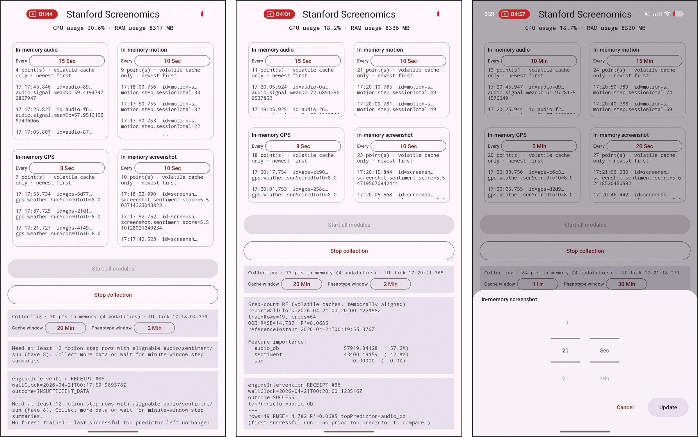

# A Software Reference Architecture for Real-Time Mobile Digital Phenotyping

Welcome — and thanks for stopping by!

This repository presents a **reference implementation of a real-time mobile digital phenotyping system** designed to demonstrate a key idea: real-time, multimodal digital phenotyping is practically achievable today through a combination of **edge computing** and **parallel processing** pipelines on mobile devices.

Rather than treating sensing, processing, and inference as separate or delayed stages, this system shows how they can be unified into a **continuous, on-device architecture** that operates in real time.

## What this project is about

At its core, this project demonstrates how a mobile system can:

- Capture multiple behavioral and environmental data streams in real time  
- Normalize them into a unified data representation (UFS)  
- Maintain a sliding-window in-memory cache for low-latency access  
- Run continuous edge computation cycles over cached data  
- Produce phenotype summaries and model-ready representations  
- Trigger downstream decision logic (intervention layer)  

The key idea is simple but powerful:  
**phenotype computation happens continuously on-device, rather than after data collection is complete.**

---

## Why this matters

Modern mobile devices are now capable of sustained sensing across multiple modalities. 
The challenge is no longer *data collection*, **but how to structure computation so that insights emerge in real time without cloud dependency**.

This architecture shows one way to do that by combining:

- **Edge computation loops** that run on a fixed cadence  
- **Parallel modality pipelines** that operate independently but feed a shared cache  
- **A unified data model (UFS)** that makes heterogeneous signals composable  
- **Lightweight on-device models and heuristics** that operate within strict resource constraints  

Together, these pieces form a practical blueprint for real-time digital phenotyping systems.

---

## System design at a glance

The system is built into two main layers with a modular architecture:

- **Data collection layer**: continuously captures multimodal signals (audio, motion, GPS, and screen content) and converts them into a unified representation (`UnifiedDataPoint`) stored in a sliding-window cache.

- **Data management layer**: operates on cache snapshots to perform window selection, phenotype computation, model inference, and downstream policy or intervention logic.

This separation between layers ensures that data collection is never blocked by computation, while allowing phenotype analysis and model inference to operate on stable cache snapshots. It improves reliability in real-time sensing and enables scalable on-device processing.

Modularity decouples modality-specific sensing logic from shared computation and storage logic, allowing each component to evolve independently without affecting the rest of the system.

---

## What you can do with this project

This is a **reference architecture** intended to demonstrate:

- How multimodal sensing systems can be structured cleanly
- How real-time pipelines can be built without external batch processing
- How edge-based phenotype computation can be implemented in practice
- How caching, windowing, and model execution can be unified in a single system

This project includes a working sample system built around four primary data streams:
- Audio
- Motion
- GPS
- Screen content (screenshots)

Each modality follows the same structural pattern:
1. Data acquisition (`DataNode`)
2. Adaptation into unified format (`Adapter`)
3. In-memory caching with sliding window retention (`Cache`)
4. Local + cloud storage fan-out
5. Participation in edge computation cycles

This system is intentionally minimal in its sample implementation, but the architecture is designed to open up much larger possibilities, including:
- Additional sensor modalities  
- More advanced on-device models  
- Personalization of phenotype computation  
- Real-time behavioral intervention systems  
- Privacy-preserving mobile analytics pipelines  

If you're interested in how **real-time mobile digital phenotyping becomes practical through edge computing and parallel processing**, this project is meant to give you a concrete starting point.

It shows how these ideas can be implemented — not just described — in a working system that runs entirely on a mobile device.

Thanks for taking a look, and enjoy exploring!